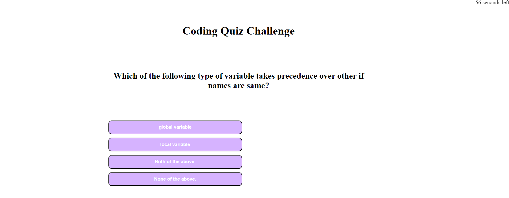

# Coding Quiz

## Technology Used 

| Technology Used         | Resource URL           | 
| ------------- |:-------------:| 
| HTML    | [https://developer.mozilla.org/en-US/docs/Web/HTML](https://developer.mozilla.org/en-US/docs/Web/HTML) | 
| CSS     | [https://developer.mozilla.org/en-US/docs/Web/CSS](https://developer.mozilla.org/en-US/docs/Web/CSS)      |   
| Javascript    | [https://developer.mozilla.org/en-US/docs/Web/javascript](https://developer.mozilla.org/en-US/docs/Web/javascript)      |   
| Git | [https://git-scm.com/](https://git-scm.com/)     |   


## Description

This is a short quiz written mostly in Javascript that dynamically updates the page by traversing the DOM based on the answer to each question. The quiz presents the user with a series of multiple-choice questions related to coding concepts such as variables, functions, frameworks, and languages. The user has a limited amount of time to complete the quiz. If the user chooses the an incorrect answer, 10 seconds is deducted from the timer, if the user chooses the right answer they are given one point and their score is tracked and displayed at the end of the quiz. Additionally, the app has a feature which displays the high scores of previous users. At the very end the users are given a choice to either go back to the first page or clear the leaderboard.



## Function examples

````java
// function to start countdown
function startCountdown() {

    var timeInterval = setInterval(function () {
        secondsLeft--;

        // display countdown on page
        startButton.style.display = 'none'
        timerEl.style.display = 'block'
        timerEl.textContent = secondsLeft + " seconds left";

        if (secondsLeft <= 0){
        clearInterval(timeInterval);
        timerEl.textContent = "Time is up!";

        
        
        }
    }, 1000);
}
````


```java
// function to display question
function displayQuestion() {
    //get the current question from array
    var question = questions[currentQuestion];
    //display the question
    questionEl.textContent = question.question;
    choicesEl.style.display = "block";
    //display the choices
    choicesEl.innerHTML = "";
    for (var i = 0; i < question.choices.length; i++) {
        var choice = question.choices[i];
        var choiceEl = document.createElement("button");
        choiceEl.textContent = choice;
        choiceEl.setAttribute("data-answer", choice);
        choiceEl.addEventListener("click", checkAnswer);
        choicesEl.appendChild(choiceEl);
      }
    }
```

 ### Find my


 * [Portfolio](https://didriklindberg.github.io/Portfolio-Site) 
* [Github](https://github.com/DidrikLindberg)

## Credits

- [UCB Bootcamp](https://bootcamp.berkeley.edu/coding/)
    - Jerome Chenette